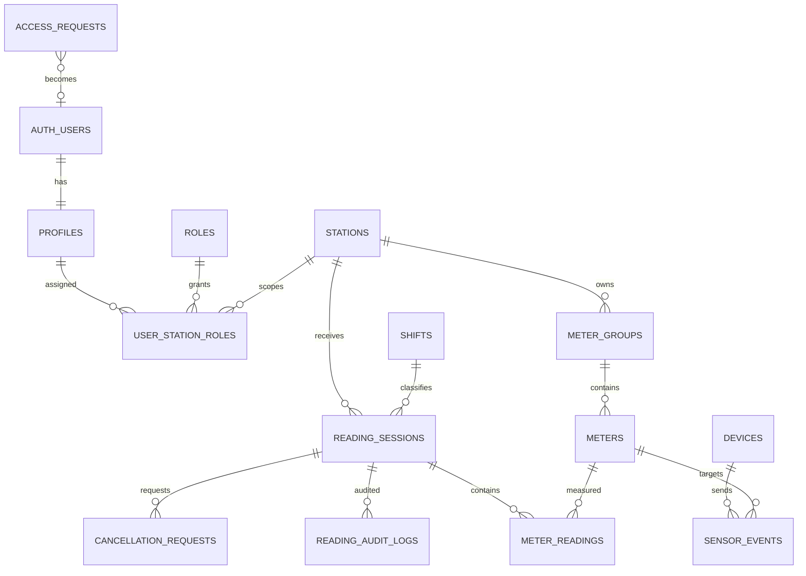

# Database Design — ระบบบริหารจัดการข้อมูลการผลิตน้ำ

## 1. วัตถุประสงค์และขอบเขต

เอกสารนี้ออกแบบฐานข้อมูลสำหรับ Supabase/PostgreSQL จากฟีเจอร์และข้อกำหนดทั้งหมดของระบบบริหารจัดการข้อมูลการผลิตน้ำ งานผลิต กปภ.สาขาสุไหงโก-ลก โดยรองรับ:

- Supabase Authentication และคำขอเข้าใช้งานครั้งแรก
- ผู้ใช้ Role สิทธิ์ตามสถานี และสถานะบัญชี
- แม่ข่าย สถานี กลุ่มมาตร และมาตรวัด
- การบันทึกมาตรน้ำดิบ 4 เวลา และมาตรหลักทางจ่ายรายชั่วโมง
- การคำนวณค่าครั้งก่อนและผลต่างที่ต้องไม่ติดลบ
- การแก้ไข ขอยกเลิก ยกเลิก กู้คืน และ Audit Log
- รายงานน้ำดิบ น้ำผลิตจ่าย และน้ำสูญเสียในระบบผลิต
- รายกะ 3 กะ รวมกะที่ข้ามวัน
- ปีงบประมาณไทย (1 ตุลาคม–30 กันยายน)
- การขยายหลายสถานี API และ Sensor/IoT ในอนาคต

หลักสำคัญคือเก็บ “ค่ามาตรสะสม” เป็นข้อมูลต้นทาง ส่วนปริมาณน้ำและน้ำสูญเสียเป็นค่าที่คำนวณได้ ไม่เปิดให้แก้ไขโดยตรง

## 2. เทคโนโลยีและมาตรฐาน

| รายการ | แนวทาง |
|---|---|
| Database | PostgreSQL บน Supabase |
| Authentication | Supabase Auth (`auth.users`) |
| Primary key | UUID (`gen_random_uuid()`) |
| เวลาในฐานข้อมูล | `timestamptz` เก็บเป็น UTC |
| เขตเวลาแสดงผล | `Asia/Bangkok` |
| วันที่ปฏิบัติงาน | `date` ตามเวลาประเทศไทย |
| ค่ามาตร | `bigint` จำนวนเต็ม ไม่ติดลบ |
| RLS | เปิดทุกตารางใน schema `public` ที่ Client เข้าถึงได้ |
| Soft delete | ใช้สถานะ ไม่ลบข้อมูลการผลิตถาวร |
| Naming | `snake_case`, ชื่อตารางพหูพจน์ |

ห้ามเก็บรหัสผ่านในตาราง `public`; รหัสผ่านและ session อยู่ใน Supabase Auth เท่านั้น

## 3. ภาพรวมความสัมพันธ์



## 4. Enums

```sql
create type public.account_status as enum (
  'pending_activation', 'active', 'suspended', 'disabled', 'locked'
);

create type public.access_request_status as enum (
  'pending', 'approved', 'rejected', 'cancelled'
);

create type public.reading_type as enum ('raw_water', 'distribution');

create type public.reading_status as enum (
  'active', 'cancellation_requested', 'cancelled'
);

create type public.audit_action as enum (
  'created', 'edited', 'cancellation_requested',
  'cancellation_approved', 'cancellation_rejected',
  'cancelled', 'restored'
);

create type public.data_source as enum ('manual', 'api', 'sensor', 'import');

create type public.device_status as enum ('active', 'inactive', 'maintenance', 'retired');
```

Role ไม่ควรใช้ PostgreSQL enum เพราะอาจเพิ่มบทบาทในอนาคต ให้ใช้ตาราง `roles` แทน

## 5. ตารางผู้ใช้และสิทธิ์

### 5.1 `access_requests`

เก็บคำขอเข้าใช้งานครั้งแรกก่อนสร้างบัญชี Auth

| Column | Type | Constraint / ความหมาย |
|---|---|---|
| id | uuid | PK |
| request_no | text | UNIQUE, เช่น `REQ-202608-0001` |
| employee_id | text | NOT NULL |
| full_name | text | NOT NULL |
| position | text | NOT NULL |
| phone | text | NOT NULL |
| email | citext | NOT NULL |
| consent_accepted_at | timestamptz | NOT NULL |
| status | access_request_status | DEFAULT `pending` |
| requested_station_id | uuid | FK stations, nullable |
| assigned_role_id | uuid | FK roles, กำหนดโดย Admin |
| reviewed_by | uuid | FK profiles |
| reviewed_at | timestamptz | nullable |
| rejection_reason | text | บังคับเมื่อ rejected |
| auth_user_id | uuid | FK `auth.users`, ใส่หลังอนุมัติ |
| created_at | timestamptz | DEFAULT now() |
| updated_at | timestamptz | DEFAULT now() |

ข้อกำหนด:

- Partial unique index ของ `employee_id` และ `lower(email)` สำหรับคำขอสถานะ `pending`/`approved`
- ผู้สมัครสร้างและอ่านคำขอของตนผ่าน Edge Function หรือ RPC ที่จำกัดข้อมูล ห้ามเปิด SELECT ทั้งตารางแก่ `anon`
- การอนุมัติควรทำผ่าน Edge Function ด้วย service role: สร้าง Auth user, profile และ role assignment ใน transaction เชิงตรรกะเดียวกัน

### 5.2 `profiles`

ข้อมูลบุคลากรที่สัมพันธ์แบบ 1:1 กับ `auth.users`

| Column | Type | Constraint / ความหมาย |
|---|---|---|
| id | uuid | PK, FK `auth.users(id)` ON DELETE RESTRICT |
| employee_id | text | UNIQUE NOT NULL |
| full_name | text | NOT NULL |
| position | text | NOT NULL |
| phone | text | NOT NULL |
| email | citext | UNIQUE NOT NULL |
| account_status | account_status | DEFAULT `pending_activation` |
| must_change_password | boolean | DEFAULT true |
| last_login_at | timestamptz | nullable |
| approved_by | uuid | FK profiles, nullable |
| approved_at | timestamptz | nullable |
| suspended_reason | text | nullable |
| created_at / updated_at | timestamptz | audit timestamps |

`auth.users` เป็นเจ้าของ identity; `profiles` เป็นเจ้าของข้อมูลธุรกิจ ห้ามใช้ `raw_user_meta_data.role` เป็นแหล่งตัดสินสิทธิ์

### 5.3 `roles`

Seed data:

| code | name_th |
|---|---|
| `admin` | ผู้ดูแลระบบ |
| `manager` | ผู้บริหาร / หัวหน้างาน |
| `supervisor` | หัวหน้าชุด / หัวหน้าประจำสถานี |
| `operator` | ผู้ปฏิบัติงาน |
| `viewer` | ผู้ตรวจสอบ |

Columns: `id`, `code` UNIQUE, `name_th`, `description`, `is_system`, `created_at`

### 5.4 `permissions` และ `role_permissions`

รองรับการเพิ่ม Role โดยไม่ hard-code ทุกสิทธิ์

ตัวอย่าง permission codes:

- `dashboard.read`
- `reading.create`
- `reading.read`
- `reading.edit_own_shift`
- `reading.edit_station`
- `reading.request_cancel`
- `reading.cancel_station`
- `reading.restore`
- `report.read`
- `user.review_request`
- `user.manage`
- `system.manage`

### 5.5 `user_station_roles`

| Column | Type | ความหมาย |
|---|---|---|
| id | uuid | PK |
| user_id | uuid | FK profiles |
| station_id | uuid | FK stations |
| role_id | uuid | FK roles |
| effective_from | date | วันที่เริ่มสิทธิ์ |
| effective_to | date | nullable |
| assigned_by | uuid | FK profiles |
| created_at | timestamptz | |

Unique active assignment: `(user_id, station_id, role_id)` เมื่อ `effective_to is null`

## 6. โครงสร้างสถานีและมาตรวัด

### 6.1 `stations`

| Column | Type | ความหมาย |
|---|---|---|
| id | uuid | PK |
| code | text | UNIQUE เช่น `SKL-MAIN` |
| name_th | text | `แม่ข่ายสุไหงโก-ลก` |
| branch_name | text | กปภ.สาขาสุไหงโก-ลก |
| timezone | text | DEFAULT `Asia/Bangkok` |
| is_active | boolean | DEFAULT true |
| created_at / updated_at | timestamptz | |

### 6.2 `meter_groups`

แบ่งแบบฟอร์มและรอบเวลา

| Column | Type | ตัวอย่าง |
|---|---|---|
| id | uuid | |
| station_id | uuid | SKL-MAIN |
| code | text | `RAW_WATER`, `DISTRIBUTION` |
| name_th | text | มาตรน้ำดิบ, มาตรหลักทางจ่าย |
| reading_type | reading_type | raw_water/distribution |
| schedule_config | jsonb | รอบที่อนุญาต |
| is_active | boolean | true |

ตัวอย่าง `schedule_config`:

```json
{"mode":"fixed_times","times":["00:00","06:00","14:00","22:00"]}
```

```json
{"mode":"hourly","minute":0}
```

### 6.3 `meters`

| Column | Type | ความหมาย |
|---|---|---|
| id | uuid | PK |
| meter_group_id | uuid | FK meter_groups |
| code | text | `RAW_1`, `RAW_2`, `HIGH`, `LOW`, `WAENG` |
| name_th | text | ชื่อแสดงผล |
| sort_order | smallint | ลำดับในฟอร์ม |
| unit | text | DEFAULT `m3` |
| register_digits | smallint | จำนวนหลักของหน้าปัด, nullable |
| rollover_value | bigint | nullable; เตรียมกรณีมาตรวนรอบ |
| installed_at | timestamptz | nullable |
| retired_at | timestamptz | nullable |
| is_active | boolean | true |

Unique: `(meter_group_id, code)`

## 7. ตารางข้อมูลการอ่านมาตร

ออกแบบเป็น Header–Detail เพื่อให้หนึ่งรอบบันทึกมีหลายมาตร และเพิ่มมาตรใหม่ได้โดยไม่แก้ schema

### 7.1 `reading_sessions`

หนึ่ง record ต่อ “สถานี + ประเภทแบบฟอร์ม + วันที่ + เวลา”

| Column | Type | Constraint / ความหมาย |
|---|---|---|
| id | uuid | PK |
| station_id | uuid | FK stations NOT NULL |
| meter_group_id | uuid | FK meter_groups NOT NULL |
| reading_date | date | วันที่ปฏิบัติงานไทย |
| reading_time | time | เวลา 00:00–23:00 |
| observed_at | timestamptz | เวลาจริงของการอ่านมาตร |
| shift_id | uuid | FK shifts, derive จาก observed_at |
| shift_business_date | date | วันที่อ้างอิงของกะ โดยกะ 3 ยึดวันที่เริ่ม 22:00 |
| status | reading_status | DEFAULT `active` |
| source | data_source | DEFAULT `manual` |
| source_ref | text | device/event/import reference |
| recorded_by | uuid | FK profiles |
| recorded_at | timestamptz | DEFAULT now() |
| updated_by / updated_at | uuid / timestamptz | |
| cancellation_reason | text | nullable |
| cancelled_by / cancelled_at | uuid / timestamptz | nullable |
| restored_by / restored_at | uuid / timestamptz | nullable |
| lock_version | integer | optimistic concurrency, DEFAULT 1 |

Unique index ที่สำคัญ:

```sql
create unique index reading_sessions_unique_active_slot
on public.reading_sessions (station_id, meter_group_id, reading_date, reading_time)
where status <> 'cancelled';
```

ผลคือห้ามวัน–เวลาเดียวกันซ้ำ แต่หลังยกเลิกสามารถสร้างรายการทดแทนได้ โดยรายการเก่ายังอยู่

### 7.2 `meter_readings`

| Column | Type | Constraint / ความหมาย |
|---|---|---|
| id | uuid | PK |
| session_id | uuid | FK reading_sessions ON DELETE RESTRICT |
| meter_id | uuid | FK meters |
| reading_value | bigint | CHECK `>= 0` |
| previous_reading_id | uuid | self FK, nullable ครั้งแรก |
| previous_value | bigint | snapshot เพื่อ audit/report |
| difference_value | bigint | CHECK `>= 0` |
| quality_status | text | `valid`, `review_required`, `missing_previous` |
| created_at / updated_at | timestamptz | |

Unique: `(session_id, meter_id)`

ไม่ควรรับ `previous_value` และ `difference_value` จาก Client เป็นข้อมูลที่เชื่อถือได้ ให้ Function ฝั่ง Database หา previous active reading แล้วคำนวณเอง

## 8. กฎธุรกิจและ Transaction

### 8.1 บันทึกรอบใหม่

ควรใช้ RPC `create_reading_session(...)` แบบ transaction:

1. ตรวจผู้ใช้ active และมี `reading.create` ในสถานี
2. ตรวจเวลาตรงกับ `schedule_config`
3. Lock ช่อง `(station, group, date, time)` ป้องกัน concurrent duplicate
4. ตรวจว่าค่าครบทุก active meter ใน group
5. หา reading ก่อนหน้าที่ `status = active` แยกตาม meter
6. คำนวณ `difference = current - previous`
7. Reject เมื่อผลต่างติดลบ เว้นแต่มี approved rollover/meter replacement workflow
8. Insert header, details และ audit log

Client แสดง confirmation ก่อนเรียก RPC แต่ Database ต้อง validation ซ้ำเสมอ

### 8.2 แก้ไขข้อมูล

RPC `edit_reading_session(session_id, new_values, reason, expected_lock_version)`:

- เหตุผลอย่างน้อย 5 ตัวอักษร
- Operator แก้ได้เฉพาะรายการตนเองและก่อนปิดกะตาม policy
- Supervisor แก้ได้ในสถานีที่รับผิดชอบ
- Admin แก้ได้ทั้งหมด
- บันทึก before/after ลง audit
- เพิ่ม `lock_version`
- คำนวณรายการนี้และรายการ active ถัดไปของแต่ละ meter ใหม่ใน transaction
- Reject ด้วย conflict เมื่อ `expected_lock_version` ไม่ตรง

### 8.3 ยกเลิกและกู้คืน

- Operator เรียก `request_reading_cancellation` → `cancellation_requested`
- Supervisor/Admin อนุมัติ → `cancelled`
- Admin กู้คืนได้เมื่อไม่ชน unique active slot
- ห้าม `DELETE` จาก Client
- ทุก action ต้องมี audit record
- หลังยกเลิก/กู้คืน คำนวณ previous link และ difference ของรายการถัดไปใหม่

## 9. Audit และคำขอยกเลิก

### 9.1 `reading_audit_logs`

| Column | Type | ความหมาย |
|---|---|---|
| id | uuid | PK |
| session_id | uuid | FK reading_sessions |
| action | audit_action | ประเภทเหตุการณ์ |
| actor_id | uuid | FK profiles |
| reason | text | nullableเฉพาะ created |
| before_data | jsonb | snapshot ก่อนเปลี่ยน |
| after_data | jsonb | snapshot หลังเปลี่ยน |
| request_id | uuid | correlation id |
| ip_address | inet | nullable |
| user_agent | text | nullable |
| created_at | timestamptz | DEFAULT now(), immutable |

Audit table ต้องเป็น append-only: ไม่มี UPDATE/DELETE policy สำหรับ Client

### 9.2 `cancellation_requests`

เก็บ workflow แยกจากสถานะปัจจุบันของ session

Columns: `id`, `session_id`, `requested_by`, `reason`, `status` (`pending/approved/rejected`), `reviewed_by`, `review_reason`, `requested_at`, `reviewed_at`

อนุญาตคำขอ pending ได้ครั้งละหนึ่งรายการต่อ session ด้วย partial unique index

## 10. กะและปีงบประมาณ

### 10.1 `shifts`

Seed data:

| code | name | start_time | end_time | crosses_midnight |
|---|---|---:|---:|---|
| `SHIFT_1` | กะที่ 1 | 06:00 | 14:00 | false |
| `SHIFT_2` | กะที่ 2 | 14:00 | 22:00 | false |
| `SHIFT_3` | กะที่ 3 | 22:00 | 06:00 | true |

กติกา `shift_business_date`:

- 22:00–23:59 → วันที่ปฏิทินนั้น
- 00:00–05:59 → วันที่ก่อนหน้า เพราะเป็นกะที่เริ่มเมื่อคืน
- 06:00–13:59 → วันที่ปฏิทินนั้น
- 14:00–21:59 → วันที่ปฏิทินนั้น

ดังนั้นกะที่ 3 วันที่ 12 สิงหาคม ครอบคลุม 12 ส.ค. 22:00 ถึง 13 ส.ค. 05:59

### 10.2 ปีงบประมาณ

ไม่จำเป็นต้องมีตารางหากใช้ Function:

```sql
create function public.thai_fiscal_year(d date)
returns integer language sql immutable as $$
  select extract(year from d)::int
       + case when extract(month from d) >= 10 then 1 else 0 end
       + 543;
$$;
```

ปีงบประมาณ 2570 คือ 1 ต.ค. 2569–30 ก.ย. 2570 (เมื่อแปลงปี ค.ศ. ให้ถูกต้องใน application)

## 11. Reports และ Views

รายงานต้องอ่านเฉพาะ `reading_sessions.status = 'active'`

### 11.1 `v_reading_facts`

View กลาง รวม station, type, meter, date/time, shift, fiscal year, reading value และ difference เพื่อเป็นฐานรายงาน

### 11.2 ปริมาณน้ำดิบ

ผลรวม `difference_value` ของ meters ในกลุ่ม `RAW_WATER`

- รายกะ: group by `shift_business_date, shift_id`
- รายวัน: group by `reading_date`
- รายเดือน: group by `date_trunc('month', reading_date)`
- รายปีงบประมาณ: group by `thai_fiscal_year(reading_date)`

### 11.3 ปริมาณน้ำผลิตจ่าย

ผลรวม difference ของ `HIGH + LOW + WAENG`

- รายชั่วโมง / รายวัน / รายเดือน / รายปีงบประมาณ

ต้องตกลงทางธุรกิจเพิ่มเติมว่า “ปริมาณรวม” คือผลรวมทั้งสามโซนแน่นอน และไม่เกิดการนับน้ำเส้นทางเดียวกันซ้ำ

### 11.4 น้ำสูญเสียในระบบผลิต

```text
loss_percent = ((raw_volume - produced_volume) / raw_volume) × 100
target_percent <= 5.00
```

ข้อกำหนด:

- คำนวณจากช่วงเวลาเดียวกันและสถานีเดียวกัน
- เมื่อ `raw_volume = 0` ให้คืน `NULL` และสถานะ `insufficient_data` ไม่ใช่ 0%
- เมื่อข้อมูลต้นทางไม่ครบ ให้แสดง `incomplete` และไม่นำไปสรุป KPI โดยไม่แจ้งเตือน
- ไม่สร้าง CRUD สำหรับผลน้ำสูญเสีย เพราะเป็น derived data
- เป้าหมาย 5% ควรอยู่ใน `report_targets` เพื่อเปลี่ยนตามช่วงเวลาได้

### 11.5 `report_targets`

Columns: `id`, `station_id`, `metric_code`, `target_operator`, `target_value numeric(8,3)`, `effective_from`, `effective_to`, `created_by`, `created_at`

Seed: `metric_code = 'PRODUCTION_LOSS_PERCENT'`, operator `lte`, value `5.000`

### 11.6 Performance

เริ่มด้วย normal views; เมื่อข้อมูลเพิ่มมากให้ใช้ materialized views รายวัน/เดือนและ refresh หลัง mutation หรือเป็น schedule ห้ามเก็บ aggregate เป็น source of truth

## 12. RLS Policy Matrix

| Resource / Action | Admin | Manager | Supervisor | Operator | Viewer |
|---|:---:|:---:|:---:|:---:|:---:|
| อ่านข้อมูลทุกสถานี | ✓ | ✓ | ตาม assignment | ตาม assignment | ตาม assignment/ขอบเขต |
| สร้าง reading | ✓ | — | ✓ | ✓ | — |
| แก้ไข | ทุกสถานี | — | สถานีตน | ของตนก่อนปิดกะ | — |
| ขอยกเลิก | ✓ | — | ✓ | ของตน | — |
| อนุมัติยกเลิก | ✓ | — | สถานีตน | — | — |
| กู้คืน | ✓ | — | — | — | — |
| Audit read | ✓ | ✓ | สถานีตน | รายการที่มองเห็น | ✓ ตามขอบเขต |
| จัดการคำขอ/ผู้ใช้ | ✓ | — | — | — | — |

แนวทาง Function ช่วย RLS:

```sql
public.has_station_permission(station_id uuid, permission_code text)
public.is_admin()
public.current_profile_status()
```

ใช้ `security definer` เฉพาะ Function ที่จำเป็น ตั้ง `search_path` แบบคงที่ และ revoke execute จาก `public` ก่อน grant ให้ role ที่เหมาะสม

## 13. Indexes ที่แนะนำ

```sql
create index reading_sessions_station_observed_idx
  on reading_sessions (station_id, observed_at desc);

create index reading_sessions_active_report_idx
  on reading_sessions (station_id, meter_group_id, reading_date, reading_time)
  where status = 'active';

create index meter_readings_meter_session_idx
  on meter_readings (meter_id, session_id);

create index audit_session_created_idx
  on reading_audit_logs (session_id, created_at desc);

create index access_requests_status_created_idx
  on access_requests (status, created_at desc);

create index user_station_roles_user_active_idx
  on user_station_roles (user_id, station_id)
  where effective_to is null;
```

## 14. Sensor/IoT และ API ในอนาคต

### `devices`

`id`, `station_id`, `code`, `name`, `device_type`, `status`, `last_seen_at`, `metadata jsonb`, timestamps

### `device_meter_bindings`

เชื่อม device/channel กับ meter: `device_id`, `meter_id`, `channel_key`, `effective_from`, `effective_to`

### `sensor_events`

เก็บ payload ดิบแบบ append-only ก่อน validation:

`id`, `device_id`, `meter_id`, `external_event_id`, `observed_at`, `received_at`, `value bigint`, `payload jsonb`, `validation_status`, `processed_session_id`, `error_message`

Unique `(device_id, external_event_id)` ทำให้ ingestion idempotent จากนั้น worker/RPC แปลง event ที่ผ่าน validation ไปเป็น reading session โดยใช้ business rules เดียวกับ manual entry

## 15. Data Integrity เพิ่มเติม

- ใช้ trigger `set_updated_at()` ทุกตาราง mutable
- ห้ามเปลี่ยน `recorded_by`, `recorded_at` หลังสร้าง
- ห้าม hard delete reading, audit และ cancellation records
- ตรวจ phone ด้วย regex ระดับพอเหมาะ; validation เชิงธุรกิจทำใน application/Edge Function
- ใช้ `citext` สำหรับ email และเปิด extension ก่อนสร้างตาราง
- ไม่เก็บชื่อผู้ใช้ซ้ำใน reading; ใช้ FK และเก็บ audit snapshot เฉพาะเมื่อมีข้อกำหนดการคงชื่อในอดีต
- กรณีเปลี่ยนมาตรหรือมาตรวนรอบต้องมี workflow เฉพาะ ห้าม bypass negative difference ด้วยการแก้ constraint
- Backup, PITR และ retention ต้องกำหนดก่อน production

## 16. ลำดับ Migration ที่แนะนำ

1. Extensions: `pgcrypto`, `citext`
2. Enums และ utility functions
3. Stations, shifts, roles, permissions
4. Access requests และ profiles
5. User–station–role assignments
6. Meter groups และ meters
7. Reading sessions และ meter readings
8. Cancellation requests และ audit logs
9. Report targets, views และ report functions
10. RLS policies และ grants
11. Seed station, shifts, roles, permissions, meters, target 5%
12. Integration tests สำหรับ constraint, RPC และ RLS

## 17. Seed Data ขั้นต้น

- Station: `SKL-MAIN` — แม่ข่ายสุไหงโก-ลก
- Raw meters: `RAW_1`, `RAW_2`
- Distribution meters: `HIGH`, `LOW`, `WAENG`
- Shifts: `SHIFT_1`, `SHIFT_2`, `SHIFT_3`
- Roles: admin, manager, supervisor, operator, viewer
- Production loss target: ≤ 5%
- ผู้ใช้เริ่มต้นควรสร้างผ่าน secure admin migration/Edge Function ไม่ใส่รหัสผ่านใน seed SQL

## 18. Test Cases ที่ฐานข้อมูลต้องผ่าน

1. บันทึกวัน–เวลาและประเภทเดียวกันซ้ำพร้อมกันสอง request ต้องสำเร็จเพียงหนึ่ง
2. ขาดค่ามาตรหนึ่งตัวต้อง rollback ทั้ง session
3. ค่าปัจจุบันต่ำกว่าค่าก่อนหน้าต้อง reject
4. แก้ไขรายการแล้ว audit มี before/after และรายการถัดไปถูกคำนวณใหม่
5. Operator ยกเลิกตรง ๆ ไม่ได้ แต่สร้างคำขอได้
6. Supervisor ข้ามสถานีไม่ได้
7. รายการ cancelled ไม่ปรากฏใน report views
8. Admin กู้คืนไม่ได้ถ้ามี active replacement slot ชนกัน
9. เวลา 02:00 วันที่ 13 ส.ค. ถูกจัดเข้ากะที่ 3 ของ business date 12 ส.ค.
10. น้ำดิบเป็นศูนย์แล้ว loss percent เป็น NULL/incomplete
11. ผู้ใช้ suspended ผ่าน Auth แล้วก็อ่านข้อมูลธุรกิจไม่ได้
12. anon ไม่สามารถอ่าน profiles, access requests หรือข้อมูลการผลิตได้

## 19. ประเด็นที่ต้องยืนยันก่อนลง Migration จริง

1. รหัสพนักงานมีรูปแบบและความยาวแน่นอนหรือไม่
2. Operator แก้ไขได้ถึงเวลาใด และ “ปิดกะ” เป็นอัตโนมัติหรือ Supervisor กดปิด
3. ต้องให้ Supervisor รับรองทุก reading หรือเฉพาะรายการผิดปกติ
4. มาตรสามารถวนรอบ/เปลี่ยนเครื่องได้หรือไม่ และจำนวนหลักของแต่ละมาตร
5. น้ำผลิตจ่ายรวมเท่ากับผลรวมสามโซนโดยไม่ซ้ำเส้นทางแน่นอนหรือไม่
6. ปีงบประมาณใช้มาตรฐาน 1 ต.ค.–30 ก.ย. หรือมีรอบเฉพาะหน่วยงาน
7. Viewer เห็นทุกสถานีหรือเฉพาะ station assignment
8. ระยะเวลาเก็บ Audit Log และข้อมูล Sensor ดิบ

## 20. ข้อเสนอแนะการ Implement

ให้ Client เรียก Database ผ่าน typed repository และ RPC เท่านั้นสำหรับ mutation สำคัญ ไม่ทำหลาย insert แยกกันจาก browser ใช้ Supabase CLI migrations, generated TypeScript types และ test RLS ด้วยผู้ใช้แต่ละ Role ก่อน deploy ทุกครั้ง

## 21. สถานะการเริ่ม Implement

สร้าง migration เริ่มต้นแล้วใน:

- `supabase/migrations/202608120001_initial_schema.sql`
- `supabase/migrations/202608120002_seed_and_reading_rpc.sql`

เพิ่ม browser client, environment guard, authentication service และ reading repository ใน `lib/supabase` และ `features/*/supabase-*.ts` แล้ว ระบบยังใช้ mock data เมื่อไม่มี API Key รายละเอียดการนำ migration ขึ้น Project อยู่ใน `supabase/README.md`
